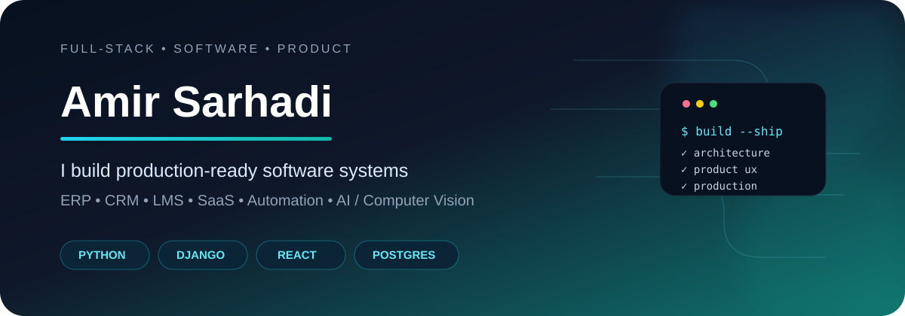
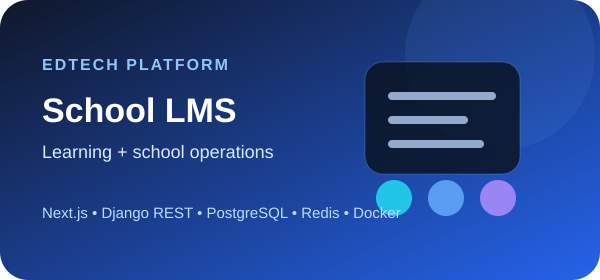
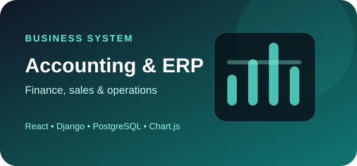
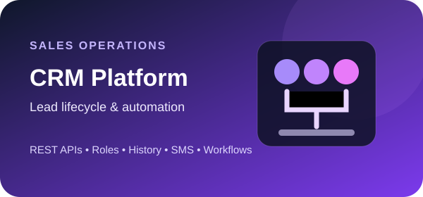
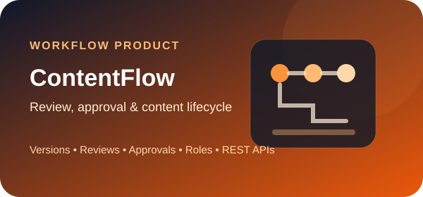
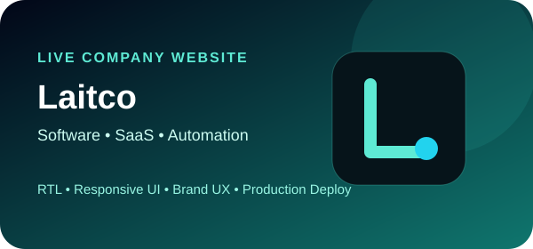
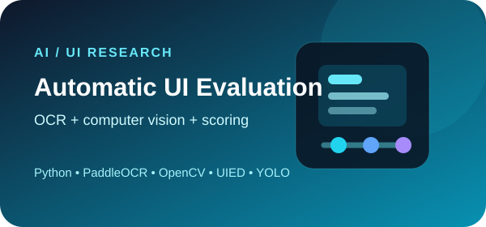

<div align="center">



<br/>

<a href="https://github.com/AmirrSarhadi"></a>
<a href="https://laitco.ir"></a>
<a href="showcase/erp-accounting-real/README.md"></a>
<a href="showcase/crm-real/README.md"></a>


<br/><br/>

**I build real products — from business workflows and APIs to polished interfaces and production deployment.**

</div>

---

## ⚡ Tech Arsenal

<div align="center">


<br/>


</div>

---

## 💻 Public Code Showcase

<div align="center">

**Production-derived, sanitized code samples from real private projects.**

[](showcase/erp-accounting-real/README.md)
[](showcase/crm-real/README.md)
[](showcase/lms-real/README.md)

<br/>

[**→ Verified ERP Code**](showcase/erp-accounting-real/README.md)
&nbsp;&nbsp;•&nbsp;&nbsp;
[**→ Verified CRM Code**](showcase/crm-real/README.md)
&nbsp;&nbsp;•&nbsp;&nbsp;
[**→ Verified LMS Code**](showcase/lms-real/README.md)

</div>

---

## 🚀 Featured Work

<table>
<tr>
<td width="50%" align="center" valign="top">
<a href="projects/school-lms.md"></a>
<br/>
<a href="projects/school-lms.md"><b>Technical Case Study →</b></a> · <a href="showcase/lms-real/README.md"><b>Real Code</b></a>
</td>
<td width="50%" align="center" valign="top">
<a href="projects/accounting-erp.md"></a>
<br/>
<a href="projects/accounting-erp.md"><b>Technical Case Study →</b></a> · <a href="showcase/erp-accounting-real/README.md"><b>Real Code</b></a>
</td>
</tr>
<tr>
<td width="50%" align="center" valign="top">
<a href="projects/crm-lead-management.md"></a>
<br/>
<a href="projects/crm-lead-management.md"><b>Technical Case Study →</b></a> · <a href="showcase/crm-real/README.md"><b>Real Code</b></a>
</td>
<td width="50%" align="center" valign="top">
<a href="projects/contentflow.md"></a>
<br/>
<a href="projects/contentflow.md"><b>Technical Case Study →</b></a>
</td>
</tr>
<tr>
<td width="50%" align="center" valign="top">
<a href="https://laitco.ir"></a>
<br/>
<a href="https://laitco.ir"><b>Live Website →</b></a> · <a href="projects/laitco.md"><b>Case Study</b></a>
</td>
<td width="50%" align="center" valign="top">
<a href="projects/automatic-ui-evaluation.md"></a>
<br/>
<a href="projects/automatic-ui-evaluation.md"><b>Research Case Study →</b></a>
</td>
</tr>
</table>

---

## 🤖 AI / Research Highlights

<table>
<tr>
<td align="center" width="33%">

### 🦾 UV Robot

Autonomous UV disinfection robot with **YOLOv5 + Python**.

[**→ Case Study**](projects/uv-disinfection-robot.md)

</td>
<td align="center" width="33%">

### 🩺 Disease Prediction

Machine-learning prediction system with chatbot interaction.

[**→ Case Study**](projects/disease-prediction-chatbot.md)

</td>
<td align="center" width="33%">

### 👁️ UI Intelligence

OCR + computer vision research for automated interface evaluation.

[**→ Research**](projects/automatic-ui-evaluation.md)

</td>
</tr>
</table>

---

## 🧩 What I Build

<div align="center">


</div>

<br/>

```text
Idea → Product Architecture → Backend/API → Frontend UX → Data → Testing → Deployment
```

---

## 📊 GitHub Snapshot

<div align="center">


<br/>


</div>

---

## 🏗️ Engineering Focus

<table>
<tr>
<td>🧱 <b>Architecture</b><br/>Modular, maintainable systems</td>
<td>🔐 <b>Security</b><br/>Role-based access &amp; safe workflows</td>
<td>🎨 <b>Product UX</b><br/>Business-first, RTL-aware interfaces</td>
</tr>
<tr>
<td>🗄️ <b>Data</b><br/>Relational modeling &amp; reporting</td>
<td>🧪 <b>Quality</b><br/>Testing, validation &amp; reliability</td>
<td>🚀 <b>Delivery</b><br/>Docker, CI/CD &amp; production deployment</td>
</tr>
</table>

---

<div align="center">

### 🌍 Build. Ship. Improve.

<a href="https://laitco.ir"></a>
<a href="showcase/erp-accounting-real/README.md"></a>
<a href="showcase/crm-real/README.md"></a>
<a href="showcase/lms-real/README.md"></a>

<br/><br/>

**Amir Sarhadi** · Full-Stack Developer · Software Engineer · Product Builder

</div>
