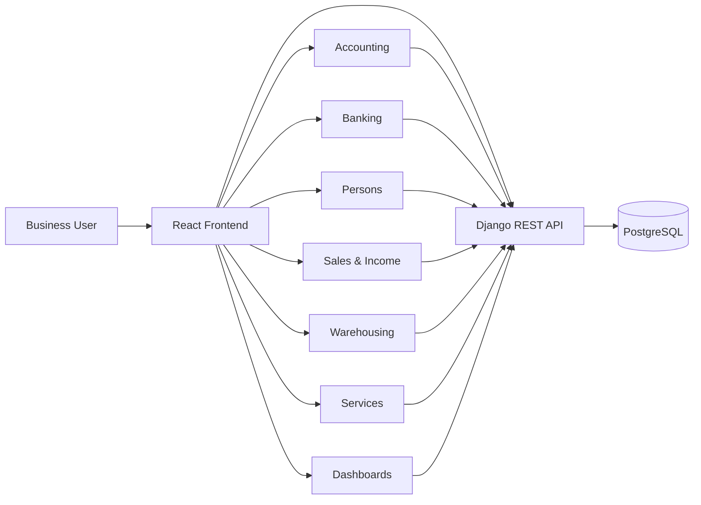

# Accounting & ERP Web Application

> Modular business management platform covering accounting, banking, sales, persons, warehousing, services, and operational reporting.

[← Back to profile](../README.md)

---

## Overview

This project is a full-stack ERP-style business application built around day-to-day accounting and operational workflows.

The platform combines financial documents, banking operations, customer/vendor management, sales, returns, inventory, services, discounts, installment workflows, and management dashboards in a single system.

The application is designed for Persian-speaking business users and includes RTL interfaces, Jalali date support, and domain-specific financial workflows.

---

## My Role

**Frontend Lead / Full-Stack Product Development**

Primary responsibilities include:

- Translating accounting workflows into usable product interfaces
- Building React-based operational screens
- Integrating frontend flows with Django REST APIs
- Designing reusable forms and dynamic transaction workflows
- Coordinating route structure and module-level frontend architecture
- Debugging API integration and data-contract issues
- Building dashboards and business-oriented UX
- Contributing to backend models and API alignment where required

---

## Core Stack

### Frontend

- React 19
- Vite
- React Router
- JavaScript / JSX
- Chart.js
- Jalali calendar support
- Persian RTL UI

### Backend

- Python
- Django 5
- Django REST Framework

### Data

- PostgreSQL

---

## High-Level Architecture



The frontend is organized around domain modules while the backend exposes business-specific REST endpoints for each operational area.

---

## Major Functional Areas

### Accounting

- Create accounting vouchers/documents
- Document listing and status workflows
- Opening balance workflows
- Fiscal-year operations
- Chart of accounts
- Aggregate accounting views
- Debit / credit line-item modeling
- Project and reference metadata

### Banking

- Bank accounts
- Cashboxes
- Imprest / petty cash
- Bank transfers
- Transfer history
- Received cheques
- Paid cheques
- Referral/reference numbers
- Bank fee handling

### Persons

- Customers
- Vendors
- Sellers
- Staff
- Drivers
- Shareholders
- Payment workflows
- Receipt workflows
- Dynamic payer / receiver selection

### Sales & Income

- Sales invoices
- Sales lists
- Sales returns
- Income entries
- Discounts
- Installment contracts
- Seller assignment
- Shipping-related data
- Payment status and payment method handling

### Warehousing

- Warehouses
- Warehouse transfers
- Transfer details and editing
- Stock items
- Cross-warehouse visibility

### Services

- Material / service records
- Add and manage service items
- Integration with transactional business flows

### Dashboard

- Bank and cashbox totals
- Sales KPIs
- Top customers
- Top vendors
- Sales charts
- Operational summaries

---

## Representative Data Model

### Accounting Document

A financial document is modeled with:

- Fiscal year
- Document number
- Automatic number
- Date
- Reference
- Project
- Description
- Currency
- Approval status
- Source metadata

Each document contains line items with debit / credit values and account references.

### Banking Transaction

Banking transactions support generic sender and receiver entities, enabling transfers between different financial sources such as:

```text
Bank
Cashbox
Imprest
Person
Other Accounting Destinations
```

The transaction flow can also track fees and independent sender/receiver references.

### Sales Invoice

Sales invoices include operational fields for:

- Customer
- Seller
- Currency
- Discounts
- Tax
- Shipping
- Payment details
- Returns
- Invoice items

This provides a richer operational model than a simple invoice header + total structure.

---

## Dynamic Payment Workflow

One of the more complex frontend areas is the payment form.

A single transaction can dynamically route money toward different receiver types:

```text
Cashbox
Imprest
Bank
Cheque
Outgoing Cheque
Person
Accounting Account
```

Each payment row can manage its own:

- Receiver type
- Receiver identity
- Amount
- Bank fee
- Reference
- Description

This requires coordinated frontend state, validation, entity loading, and backend payload design.

---

## Banking Transfer UX

The transfer flow uses segmented source/destination categories and dynamically loads eligible entities.

Representative flow:

```text
Select source type
      ↓
Select source entity
      ↓
Select destination type
      ↓
Select destination entity
      ↓
Enter amount / fees / references
      ↓
Review deducted and credited totals
      ↓
Submit transaction
```

The UI exposes both the deducted amount and credited amount so fees remain visible to the user before submission.

---

## Localization & UX

The application is designed for Persian accounting workflows rather than being a generic English admin panel translated afterward.

Key localization decisions include:

- RTL layout
- Persian business terminology
- Jalali dates
- Persian-friendly forms
- Business-specific dropdown labels
- Local accounting concepts and workflows

---

## Frontend Engineering Challenges

### 1. Large modular route structure

The application contains many operational pages across accounting, banking, persons, sales, and warehousing. Route organization and navigation consistency are important to prevent the frontend from becoming a collection of unrelated screens.

### 2. Dynamic financial forms

Payment and transfer forms change fields based on source and destination types. This requires controlled state models rather than static forms.

### 3. API contract consistency

Large systems often accumulate inconsistent endpoint naming. During development, integration issues such as route mismatches and required-field differences need to be identified and normalized without breaking adjacent workflows.

### 4. Financial correctness in the UI

Accounting interfaces must make money movement understandable before submission. Summaries, source/destination clarity, fees, totals, and references are part of correctness—not only presentation.

### 5. RTL responsiveness

Business tables, forms, dropdowns, sidebars, and dashboards all need to remain readable on smaller screens while preserving RTL behavior.

---

## Backend Domain Design

Representative backend entities include:

```text
FiscalYear
Project
Account
Document
DocumentItem
Bank
CashBox
Imprest
Transaction
SalesInvoice
SalesInvoiceItem
IncomeDiscount
Person Types
```

The backend is structured around explicit domain models rather than storing business operations as loosely typed generic records.

---

## API Integration Examples

The frontend consumes dedicated APIs for:

- Customers
- Vendors
- Staff
- Sellers
- Banks
- Cashboxes
- Imprests
- Payments
- Sales invoices
- Returned sales
- Materials / services

This keeps domain data loading independent while allowing composite transaction screens to combine multiple datasets.

---

## Product Design Principles

- Financial clarity before submission
- Reusable transaction patterns
- Explicit domain modeling
- Persian-first UX
- Modular architecture
- Operational workflows over demo dashboards
- API-driven frontend
- Progressive expansion by business module

---

## Representative Engineering Areas

```text
Accounting         Documents, vouchers, debit/credit items, fiscal years
Banking            Banks, cashboxes, imprest, transfers, cheques
People             Customers, vendors, staff, sellers, shareholders
Sales              Invoices, returns, discounts, installments
Warehousing        Stock, warehouses, internal transfers
Frontend            React, routing, dynamic forms, RTL interfaces
Data Visualization  KPIs, charts, operational summaries
Backend             Django, DRF, PostgreSQL domain models
```

---

## Repository Visibility

The full source is maintained privately because the project contains product-specific business logic and deployment-specific implementation.

This case study is intentionally limited to architecture, product scope, technical decisions, and representative workflows.

---

## Status

**Active development**

The platform already includes the core accounting and operational modules and continues to evolve around additional workflows, reporting, and integration refinement.

---

[← Back to Amir Sarhadi's GitHub profile](../README.md)
