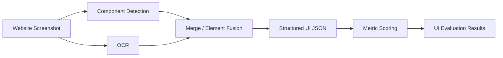

# Automatic UI Evaluation — OCR + Computer Vision Research

> Research project for automatically extracting interface elements from screenshots and computing UI/UX quality metrics across Persian and international websites.

[← Back to profile](../README.md)

---

## Overview

This research project explores how user interfaces can be evaluated automatically from screenshots using a combination of OCR, computer vision, element extraction, and rule-based scoring.

The goal is to move beyond subjective visual inspection and build a reproducible pipeline that converts a screenshot into structured interface data and then computes measurable UI characteristics.

The system is designed to support multilingual interfaces, including Persian / RTL websites, where conventional OCR and layout-analysis pipelines often require additional handling.

---

## Research Objective

The core question is:

> Can visual interface quality be partially evaluated automatically by extracting UI elements from screenshots and calculating measurable design characteristics?

The project focuses on measurable structural properties such as spacing, density, alignment, contrast, hierarchy, and visual balance rather than attempting to replace human usability studies entirely.

---

## Pipeline



The extraction stage combines visual component detection and OCR so text and non-text interface elements can be represented in a common coordinate system.

---

## Interface Element Extraction

The extraction pipeline builds on customized UIED-style component analysis together with OCR.

Representative output structure:

```json
{
  "type": "Text | Compo",
  "bbox": {
    "left": 0,
    "top": 0,
    "right": 0,
    "bottom": 0
  }
}
```

Each detected interface element can therefore be analyzed spatially relative to the page and to other elements.

---

## OCR Strategy

### PaddleOCR

The OCR layer uses PaddleOCR with language-aware handling for interfaces containing:

- Persian
- Arabic
- Latin text

Because Persian OCR quality can vary, the pipeline includes fallback behavior using Arabic and Latin recognition where appropriate.

### Orientation handling

Text-line orientation support is enabled to improve recognition across varied UI layouts.

### Why OCR matters

OCR is not used only for reading text content. Text bounding boxes are important for computing:

- Text density
- Heading hierarchy
- Alignment
- Spacing
- Button/text proximity
- Text/image balance

---

## Computer Vision

OpenCV-based processing is used for component detection and geometric analysis.

The pipeline identifies interface regions and combines them with OCR detections to reduce the gap between visual components and textual elements.

Auxiliary experiments also use YOLO-style element detection for classes such as:

```text
Button
Text
Icon
Image
Input
```

A broader public-label mapping was also explored to align the custom dataset with more granular UI element categories.

---

## Dataset

The evaluation dataset contains **200 website screenshots** captured at a consistent **1920 × 1080** resolution.

### Iranian websites

- 100 websites
- 10 categories
- 10 websites per category

### International websites

- 100 websites
- Category-matched samples from WebUI-7k
- 10 corresponding categories
- 10 websites per category

This design allows comparative analysis between Persian / Iranian interfaces and international interfaces while keeping category composition balanced.

---

## Example Metrics

The scoring pipeline evaluates multiple measurable interface properties.

### Layout & Space

- Occupied-area ratio
- Whitespace ratio
- Visual density
- Alignment consistency

### Typography

- Text density
- Heading hierarchy
- Text distribution

### Visual Design

- Contrast
- Color palette size
- Image-to-text ratio
- Focal-element presence

### Interaction Proximity

- Button/text proximity
- Element spacing
- Component grouping

### Language / Direction

- RTL detection
- Bilingual-layout indicators

---

## Occupied-Area Analysis

One representative metric is the occupied-area ratio:

```text
ρ = occupied UI area / total page area
```

The scorer uses this value as one signal for whether a page is visually sparse, balanced, or overcrowded.

The metric is not treated as a universal quality score by itself; it contributes to a larger set of layout indicators.

---

## Full-Page Bilingual Scoring

Two scoring approaches were compared during development, and the bilingual full-page scorer became the primary evaluation path.

The full-page approach is useful because it evaluates the screenshot as a complete interface rather than scoring isolated crops without page-level context.

This is especially important for:

- Navigation density
- Overall whitespace
- Page hierarchy
- Cross-section alignment
- Global visual balance

---

## Persian / RTL Challenges

Persian interfaces introduce several issues that standard English-first evaluation pipelines do not handle well automatically.

### OCR quality

Persian characters, joined forms, and mixed Persian/Latin content can reduce OCR reliability.

### RTL geometry

Alignment assumptions designed for LTR interfaces can produce incorrect conclusions when evaluating right-aligned layouts.

### Bilingual pages

Some Iranian interfaces mix Persian labels with Latin product names, numbers, or technical terms, requiring direction-aware processing.

These concerns are treated as part of the evaluation methodology rather than as preprocessing noise.

---

## Runtime

The pipeline was tested on a Windows development machine with:

- Intel Core i9-class CPU
- 32 GB RAM

Representative processing time was approximately **11 seconds per screenshot** during the tested pipeline configuration.

This runtime includes OCR and visual element processing and provides a baseline for future optimization or GPU acceleration.

---

## Research Methodology

The project separates the problem into two layers:

```text
1. Interface Understanding
   Screenshot → detected elements → structured JSON

2. Interface Evaluation
   Structured JSON → measurable metrics → comparative scores
```

This separation allows the extraction layer and scoring methodology to be evaluated independently.

---

## Why This Matters

Manual UI reviews are useful but expensive and difficult to scale across hundreds or thousands of interfaces.

An automated system can support:

- Large-scale website comparison
- Dataset analysis
- Design-quality benchmarking
- Research on regional interface patterns
- Automated pre-screening before human review
- UI regression analysis

The intended role is decision support, not complete replacement of expert or user evaluation.

---

## Current Limitations

The project explicitly recognizes several limitations:

- OCR accuracy varies across Persian websites
- Visual metrics do not fully represent usability
- Semantic meaning is harder to infer than geometry
- A visually balanced interface can still have poor user experience
- Human evaluation is still needed for external validation

Human-subject comparison is therefore considered an important validation stage rather than something the automated score can assume.

---

## Technical Stack

```text
Python
PaddleOCR
OpenCV
UIED-style component extraction
YOLO / Ultralytics experiments
JSON-based element representation
Bilingual / RTL-aware scoring
```

---

## Engineering Contributions

Representative technical work includes:

- Customizing UI element extraction for the research pipeline
- Integrating OCR and visual component detections
- Handling Persian / Arabic / Latin OCR behavior
- Designing merged structured element output
- Developing bilingual full-page scoring
- Building literature-inspired UI metrics
- Preparing and organizing a balanced 200-site dataset
- Mapping UI element classes across different dataset schemas
- Benchmarking runtime and extraction behavior

---

## Research Status

**Active research / evaluation work**

The automated extraction and scoring pipeline is implemented and has been used for dataset-level analysis. Human-evaluation validation remains a separate research stage.

---

## Repository Visibility

The complete research code and dataset are not currently published as part of this profile.

This public case study summarizes the methodology, engineering pipeline, dataset design, and evaluation approach without distributing third-party dataset material or unfinished research artifacts.

---

[← Back to Amir Sarhadi's GitHub profile](../README.md)
