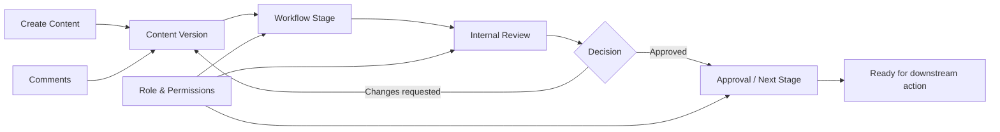

# ContentFlow

> Workflow-oriented content operations platform for planning, review, approval, and controlled publishing processes.

[← Back to profile](../README.md)

---

## Overview

ContentFlow is a workflow-driven application designed to organize content operations across multiple stages, roles, and review states.

The product focuses on the operational side of content management: creating and tracking content items, moving them through internal review and approval, keeping versions and comments traceable, and giving teams a clear view of what requires action.

Rather than treating content as a simple CRUD entity, the system models content as a lifecycle with state transitions, permissions, review stages, and ownership.

---

## My Role

**Frontend Development / Workflow Product Engineering**

Responsibilities include:

- Building and refining workflow-oriented frontend screens
- Integrating pages with Django REST APIs
- Implementing internal-review and approval interfaces
- Handling loading, error, and empty states consistently
- Maintaining route and page-level architecture
- Debugging API/UI contract mismatches
- Aligning frontend behavior with backend permissions and lifecycle rules
- Updating the project roadmap as features are completed

---

## Product Scope

Representative areas of the platform include:

- Workspaces
- Client / account structure
- Instagram page management
- Content items
- Content versions
- Stage-based workflows
- Approval decisions
- Internal reviews
- Version comments
- Role-aware access
- Content administration

---

## High-Level Workflow



The core product model is built around explicit state transitions rather than relying on informal coordination outside the system.

---

## Backend-Oriented Domain Structure

The backend architecture separates several responsibilities into dedicated areas.

### Clients

Representative entities and APIs include:

- Workspace management
- Instagram page management

### Contents

Content-related logic manages the content item itself and its versioned workflow state.

### Approvals

Approval functionality includes concepts such as:

- Approval decisions
- Version comments
- Internal reviews
- Stage-version access

This separation makes workflow rules easier to reason about than embedding every state transition directly into a single oversized content endpoint.

---

## Workflow Design Principles

### Explicit state

A content item should always have a clear lifecycle state so teams can answer:

```text
What is this item?
Where is it in the workflow?
Who needs to act next?
What changed?
Why was it rejected or approved?
```

### Version-aware review

Reviewing a mutable content record without version context can make feedback ambiguous. Version-oriented review makes comments and approval decisions easier to trace.

### Role-aware actions

The UI should not only hide irrelevant controls; the backend must also enforce who can see and act on each workflow stage.

### Auditability

Comments, decisions, state transitions, and reviewer actions are treated as part of the product history rather than disposable UI state.

---

## Frontend Engineering Focus

### Review interfaces

Review pages need to prioritize actionability:

- What item is being reviewed?
- What version is current?
- What decision options are available?
- What comments already exist?
- What changed since the previous version?

### Consistent async states

Workflow-heavy interfaces frequently load related data from multiple endpoints. Pages therefore need predictable handling for:

- Loading
- Empty data
- Permission denial
- API validation errors
- Missing resources
- Retry behavior

### Page architecture

As the application expands, page organization becomes important for maintainability. Dedicated pages for internal review and related workflows prevent review logic from being scattered across unrelated screens.

---

## Representative API Concerns

A workflow product typically coordinates several types of API calls:

```text
Workspace context
       ↓
Accessible content
       ↓
Current version / stage
       ↓
Review state
       ↓
Comments / decisions
       ↓
Allowed next actions
```

This requires the frontend to distinguish between domain state and UI state. A successful HTTP response is not enough; the interface must understand whether the user is actually allowed to take the next workflow action.

---

## Engineering Challenges

### 1. Keeping frontend and backend lifecycle rules aligned

Workflow bugs often appear when the frontend assumes a transition is allowed but the backend rejects it. The solution is to make status rules explicit and use backend responses as the authority.

### 2. Avoiding duplicate workflow logic

Approval and review rules should not be independently reimplemented on every page. Shared API helpers and reusable UI patterns reduce drift.

### 3. Version-aware user experience

Comments and decisions need enough context to remain meaningful after a content item changes.

### 4. Permission-sensitive navigation

Users should see an interface appropriate to their role while authorization remains enforced server-side.

### 5. Maintaining delivery visibility

Because the application is developed incrementally, roadmap updates and repository-level progress tracking are part of the engineering workflow, not a separate afterthought.

---

## Product Design Goals

- Make the next required action obvious
- Reduce workflow ambiguity
- Keep review history traceable
- Separate content data from approval state
- Preserve version context
- Make operational pages easy to maintain
- Keep API errors understandable at the UI layer

---

## Representative Engineering Areas

```text
Workflow Modeling     Stages, decisions, state transitions
Review Operations     Internal review, comments, approvals
Content Lifecycle     Content items and versioned state
Access Control        Role-aware visibility and actions
Frontend Architecture Pages, routing, reusable API patterns
API Integration       Validation, errors, async states
Delivery Process      Roadmap tracking and incremental releases
```

---

## Repository Visibility

The full application source is not published as part of this portfolio.

This public case study focuses on product architecture, workflow design, engineering responsibilities, and representative implementation concerns without exposing private business data or proprietary application code.

---

## Status

**Active development**

The platform is being developed iteratively, with frontend and backend workflow coverage expanded in phases and development progress documented alongside implementation.

---

[← Back to Amir Sarhadi's GitHub profile](../README.md)
