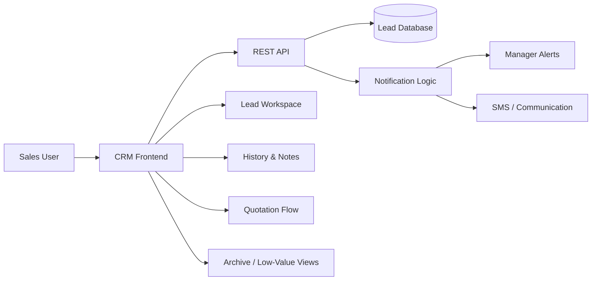

# CRM & Lead Management Platform

> Business CRM focused on lead lifecycle, sales follow-up, operational visibility, communication history, and conversion workflows.

[← Back to profile](../README.md)

---

## Overview

This project is a business CRM designed around the full operational lifecycle of a lead — from first contact through qualification, follow-up, quotation, archival, and low-value classification.

The product is built for teams that need to work with a large number of leads while preserving context, history, ownership, and status transitions across the sales process.

The original production application is private. This page is a sanitized portfolio case study describing the product architecture, workflow design, and engineering challenges without exposing customer data or internal business configuration.

---

## My Role

**Full-Stack Product Development / Workflow Engineering**

Key areas of work include:

- Designing lead-management workflows
- Implementing lead list and board experiences
- Building edit and status-transition flows
- Creating lead history and note structures
- Designing archive and low-value lead separation
- Integrating notifications and communication triggers
- Debugging REST API contracts and state transitions
- Improving filtering, loading, and interaction states for large datasets
- Maintaining Persian RTL business UX

---

## Product Scope

### Lead Lifecycle

The CRM manages leads across operational states rather than treating them as static contact records.

Representative lifecycle:

```text
New Lead
   ↓
Initial Review
   ↓
Follow-up
   ↓
Qualified
   ↓
Quotation / Offer
   ↓
Won / Lost / Archived
```

Low-value and archived leads are intentionally separated from the active operational workflow so sales teams can keep their main workspace focused.

---

## Major Functional Areas

### Lead Management

- Lead creation
- Lead editing
- Lead detail view
- Lead status changes
- Lead ownership and assignment
- Lead categorization
- Active, archived, and low-value lead separation

### Lead History

Each lead can maintain an operational history containing actions and changes over time.

The history is designed to answer questions such as:

- Who changed the lead?
- What changed?
- When did it change?
- What follow-up information was recorded?
- What happened before a lead reached its current stage?

### Notes

Notes are modeled as timeline entries rather than a single overwriteable text field.

Each note can preserve:

- Author
- Timestamp
- Content
- Relationship to the lead

This makes the CRM useful as a shared operational record instead of only a personal sales notebook.

### Archival

Leads that should no longer appear in the active workflow can be archived without being permanently deleted.

This preserves historical information while keeping current sales views clean.

### Low-Value Lead Workflow

Low-value leads have their own dedicated workflow and listing instead of being mixed into archived records or normal active sales leads.

This allows the business to retain the lead while keeping active pipelines focused on higher-priority opportunities.

---

## Sales Workflow Automation

The platform supports event-driven behavior as a lead progresses through the sales process.

For example, when a lead reaches a quotation-related stage, the system can trigger downstream actions such as:

```text
Lead reaches quotation stage
            ↓
Business rule evaluation
            ↓
Manager notification
            ↓
Optional SMS / communication trigger
            ↓
Follow-up visibility in CRM
```

This reduces dependency on manual reminders and helps ensure important sales transitions are visible to management.

---

## Lead Workspace UX

A CRM used daily by sales teams needs to make high-volume interaction efficient.

Important interface areas include:

- Fast filtering
- Status-based views
- Board and table perspectives
- Loading states for large datasets
- Search and sorting
- Clearly separated archived and low-value leads
- Inline actions and edit flows
- Accessible lead history

The goal is to reduce unnecessary navigation while keeping the lead's current state and next action obvious.

---

## High-Level Architecture



The frontend is responsible for operational usability while the backend remains the source of truth for status transitions, lead history, and business rules.

---

## Engineering Challenges

### 1. Status transitions must persist correctly

Lead status changes affect downstream workflows, filters, notifications, and reporting. This means status editing cannot be treated as a simple visual change; the backend contract, accepted values, and validation must remain aligned with the frontend.

### 2. History is an operational feature

A CRM becomes significantly less useful if previous actions are lost. History endpoints and timeline data need to remain reliable because they provide context for sales decisions and accountability.

### 3. Archive and low-value are different concepts

A low-value lead may still deserve future follow-up, while an archived lead may simply be inactive. Keeping these concepts separate improves both reporting and day-to-day sales UX.

### 4. Large lead datasets require deliberate UX

Filtering, pagination/loading behavior, clear state indicators, and separate views become increasingly important as the number of leads grows.

### 5. Workflow changes affect multiple screens

Adding a lead state is not only a database change. It can affect:

```text
Forms
Filters
Board columns
Lists
History
Notifications
Reports
Permissions
```

This requires workflow changes to be treated as cross-cutting product changes rather than isolated frontend patches.

---

## API & Integration Concerns

Representative REST interactions include:

- Lead list retrieval
- Lead detail retrieval
- Lead creation
- Lead update / PATCH
- Lead history retrieval
- Filtering by status
- Archive and low-value queries
- Notification-triggering state changes

A significant part of maintaining this type of application is keeping frontend state, accepted backend values, and API routes synchronized as the business model evolves.

---

## Reliability & Debugging

Real production CRM development includes diagnosing issues such as:

- `400 Bad Request` on lead updates
- Missing or incorrect status mappings
- `404` history endpoints
- Service availability failures on supporting APIs
- UI states that no longer match backend workflow states

The development approach is to identify whether each issue originates from:

```text
Frontend payload
API route
Serializer / validation
Database model
Business rule
Deployment / service availability
```

This keeps fixes targeted and avoids masking backend problems with frontend workarounds.

---

## Product Design Principles

- Preserve lead history
- Keep active sales views focused
- Separate distinct business states explicitly
- Make the next sales action visible
- Enforce status rules in the backend
- Keep notification logic tied to business events
- Avoid destructive deletion for operational records
- Design for high-volume daily use

---

## Representative Engineering Areas

```text
Lead Lifecycle       Statuses, qualification, archival, low-value flows
Sales UX             Tables, boards, filtering, search, loading states
History              Notes, authorship, timestamps, activity timeline
Automation           Manager alerts, SMS triggers, stage-based actions
API Integration      REST endpoints, PATCH flows, validation handling
Data Integrity       Persistent state transitions and historical context
Localization         Persian RTL business interfaces
Debugging            400/404/503 diagnosis across frontend and backend
```

---

## Repository Visibility

The production source remains private because it contains business-specific logic, customer workflows, and operational configuration.

This public case study excludes:

- Customer and lead data
- Internal phone numbers and contact details
- Private business rules
- Authentication secrets
- Production environment configuration
- Proprietary organization-specific logic

---

## Status

**Active development / production maintenance**

The platform continues to evolve as lead workflow rules, reporting needs, sales states, and business automation requirements change.

---

[← Back to Amir Sarhadi's GitHub profile](../README.md)
