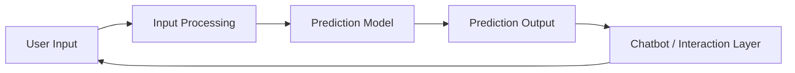

# Disease Prediction & Chatbot

> Applied machine-learning and conversational-system project for symptom-driven prediction and user interaction.

[← Back to profile](../README.md)

---

## Overview

This project explores the combination of machine-learning prediction and conversational interaction in a health-oriented software context.

The system was designed around two complementary layers:

- A prediction component that processes structured user inputs
- A chatbot-style interaction layer that makes the system easier to use

The project demonstrates how ML output can be integrated into a user-facing application rather than remaining as a standalone model experiment.

---

## Core Areas

- Machine Learning
- Prediction Systems
- Chatbot Interaction
- Applied Research
- Python-based experimentation

---

## High-Level Flow



---

## Engineering Focus

### Prediction Pipeline

The project focuses on taking user-provided information, preparing it for a trained prediction workflow, and returning interpretable output through the application layer.

### Conversational UX

The chatbot component provides a more natural interaction surface than a raw model form, helping translate prediction results into a guided user experience.

### Applied Research

The project sits at the intersection of software engineering and machine learning, with emphasis on turning model behavior into an actual interactive product flow.

---

## Key Challenges

- Mapping user input into model-compatible features
- Keeping prediction flow and conversational flow synchronized
- Presenting model output in an understandable way
- Separating experimental ML logic from application behavior
- Avoiding overclaiming what a predictive model can infer in a health context

---

## Project Value

This project strengthened practical experience across:

```text
Machine Learning
Prediction Pipelines
Python
Conversational Interfaces
Applied Research
ML-to-Product Integration
```

---

## Publication Context

This work is associated with research activity from the 2023–2024 period and an IEEE ICSPCRE 2024 publication context.

The exact publication metadata is intentionally not reproduced here until authorship/title details are verified for the public portfolio.

---

## Repository Visibility

The full implementation is not currently published as part of this profile. This case study summarizes the engineering and research focus without exposing unpublished code or unverified publication claims.

---

[← Back to Amir Sarhadi's GitHub profile](../README.md)
