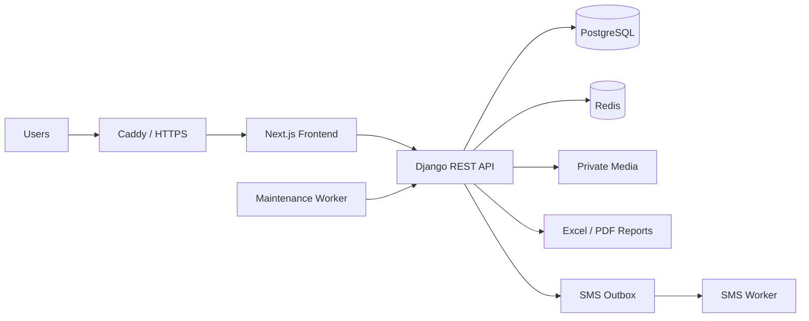

# School LMS & Management Platform

> Production-oriented full-stack school management and learning platform.

[← Back to profile](../README.md)

---

## Overview

This project is a full-stack LMS and school operations platform designed around real administrative, educational, financial, and communication workflows.

The system goes beyond course delivery. It brings together student administration, role-based access, attendance, assignments, exams, grading, finance, messaging, admissions, reporting, and production operations in one platform.

The original production repository is private. This page is a sanitized technical case study intended to demonstrate the architecture, engineering decisions, and product scope without exposing private organizational data, credentials, or production configuration.

---

## My Role

**Full-Stack Development / Product Engineering**

Work across the system includes:

- Backend architecture and REST APIs
- Frontend application development
- Relational data modeling
- Authentication and role-based authorization
- Operational workflows
- Reporting and document generation
- Automated testing
- Production deployment architecture
- Security and data-access boundaries

---

## Core Stack

### Frontend

- Next.js 16
- React 19
- TypeScript
- Vazirmatn RTL typography
- Playwright end-to-end testing

### Backend

- Python
- Django 5.2
- Django REST Framework
- Gunicorn
- ReportLab
- OpenPyXL

### Data & Infrastructure

- PostgreSQL 17
- Redis 7
- Docker / Docker Compose
- Caddy reverse proxy
- Automated HTTPS
- Persistent private media and database volumes

---

## High-Level Architecture



The production stack separates frontend, backend, database, cache, reverse proxy, and maintenance workloads while keeping user-uploaded media private and persistent.

---

## Major Functional Areas

### Identity & Access

- Multi-role user accounts
- Explicit active-role handling
- Student, parent, teacher, management, and finance workflows
- Role-aware API access
- First-login password-change controls
- Session and CSRF protections
- Captcha and OTP-based flows

### School Structure

- Academic years
- Classes
- Subjects
- Teacher assignments
- Student enrollment
- Parent/student relationships
- Safe archive lifecycle instead of destructive deletion

### Attendance

- Student attendance
- Teacher attendance
- Scheduled sessions
- Review and approval workflows
- Audit-aware corrections

### Assignments & Exams

- Assignment creation and submission
- Teacher review
- Exam management
- Assessment and grading
- Course correction workflows
- Student-facing academic information

### Finance

- School financial operations
- Account-level workflows
- Structured finance reporting
- Role-based finance access

### Communication

- Direct and group messaging
- Notification workflows
- SMS outbox architecture
- Background SMS processing

### Admissions

- Configurable admission fields
- Document submission
- Controlled retention and expiry
- Administrative review workflows

### Reporting & Data Exchange

- Management dashboards
- Excel imports with preview-before-apply workflow
- Excel exports
- PDF reporting
- Validation before mutation
- Audit records for data-import operations

---

## Data Import Safety

A key engineering requirement was making bulk data operations safer than a simple spreadsheet upload.

The import workflow uses a staged model:

```text
Upload
  ↓
Validation
  ↓
Preview
  ↓
Explicit Apply
  ↓
Transactional Database Update
  ↓
Audit Record
```

The system is designed to reject malformed structures, conflicting records, invalid account states, and duplicate domain data before changes are committed.

---

## Production Architecture

The deployment design includes:

- PostgreSQL service with health checks
- Password-protected Redis
- Django/Gunicorn backend
- Next.js standalone frontend
- Caddy edge proxy and HTTPS termination
- Persistent database, cache, static, and private-media volumes
- Readiness and liveness health endpoints
- Background maintenance process
- Optional SMS worker profile
- Restart policies for core services

This keeps the production topology reproducible and avoids coupling deployment to a single manually configured server.

---

## Reliability & Operations

Operational concerns handled by the platform include:

- Health/readiness checks
- Structured deployment services
- Persistent storage
- Background maintenance tasks
- SMS queue processing
- Data cleanup jobs
- Backup and restore procedures
- Release-oriented production configuration
- CI-oriented frontend and backend verification

---

## Testing Strategy

The project uses both backend and browser-level verification.

### Backend

Django test suites cover domain workflows, access rules, reports, imports, and school operations.

### Frontend / E2E

Playwright is used for browser-level workflow tests.

### Static Verification

TypeScript type checking and production builds are part of the frontend verification workflow.

---

## Engineering Challenges

### 1. Multi-role authorization

School applications contain overlapping user types and responsibilities. A user can have access to different operational scopes, so authorization must be enforced server-side rather than relying on navigation visibility alone.

### 2. Preserving historical academic data

Deleting a class, assignment relationship, or enrollment can destroy historical context. The platform therefore favors lifecycle/archive semantics where historical records need to remain auditable.

### 3. Safe bulk imports

Spreadsheet imports are operationally powerful but risky. The solution separates preview from apply and validates the import before a database transaction is performed.

### 4. Private file handling

Student and admission files must not be treated as ordinary public static assets. Production storage separates private media from publicly served static files.

### 5. Production observability

The deployment includes application and dependency health checks so service readiness can be evaluated independently of whether a container process merely exists.

---

## Product Design Principles

- Real workflows over demo-only screens
- Server-side authorization
- Non-destructive historical data handling
- Explicit validation before bulk mutations
- Clear role boundaries
- Responsive RTL user experience
- Production deployment considered during development, not after it

---

## Representative Engineering Areas

```text
Authentication        Role-aware access, OTP, sessions, CSRF
School Operations     Classes, enrollment, schedules, attendance
Learning              Assignments, exams, grading, report cards
Finance               Financial operations and reporting
Communication         Messages, SMS workflows, notifications
Data Engineering      XLSX import/export, validation, reporting
Infrastructure        Docker, PostgreSQL, Redis, Caddy, Gunicorn
Quality               Django tests, Playwright, TypeScript checks
```

---

## Repository Visibility

The full repository remains private because it contains product-specific implementation and organization-specific configuration and documentation.

This public case study intentionally excludes:

- Credentials and secrets
- Test-account passwords
- Organization-specific identifiers
- Production environment values
- Private user or school data
- Proprietary implementation details that are not required to evaluate the engineering work

---

## Status

**Active development / production preparation**

The system already covers the primary school-management and learning workflows, while production-specific integrations and organization-specific data mappings can be completed independently of the core platform.

---

[← Back to Amir Sarhadi's GitHub profile](../README.md)
