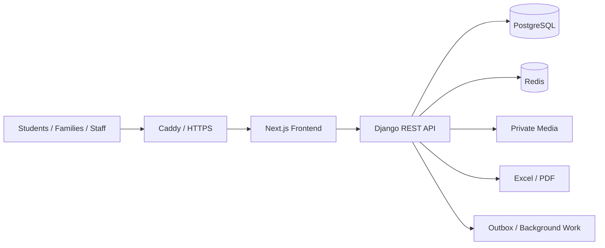

# School LMS & Management Platform

> Source-verified, production-oriented school management and learning platform.

[← Back to profile](../README.md)

---

## Overview

This is a real customer LMS and school-operations platform built around educational, administrative, financial, communication, reporting, and production workflows.

The source review confirms that the system goes well beyond a simple course portal. It implements role-aware school operations, controlled data exchange, exams, grading, corrections, attendance, finance, messaging, admissions, reporting, and a production deployment stack.

The original repository remains private. This case study and the linked code showcase are sanitized to remove customer identity, demo credentials, environment values, and organization-specific configuration.

---

## Verified Stack

### Frontend

- Next.js 16.3.6
- React 19
- TypeScript 5.7
- Playwright
- Vazirmatn
- lucide-react

### Backend

- Python
- Django 5.2
- Django REST Framework 3.16
- Gunicorn
- ReportLab
- OpenPyXL

### Infrastructure

- PostgreSQL 17
- Redis 7
- Docker Compose
- Caddy
- Private persistent media
- Health / readiness checks
- Background maintenance worker
- Optional SMS worker

---

## High-Level Architecture



---

## Source-Verified Engineering Highlights

### 1. Safe XLSX Import: Preview → Apply

Bulk imports are intentionally split into two phases:

```text
Upload
  ↓
Validate structure and rows
  ↓
Create preview batch
  ↓
Explicit apply using the same file
  ↓
Transactional database mutation
  ↓
Audit record
```

Verified implementation details include:

- XLSX-only input
- file-size and expanded-archive limits
- row-count limits
- formula rejection
- exact header validation
- per-row validation and warnings
- content fingerprinting
- expiring preview batches
- one-time apply semantics
- row locking during apply
- `transaction.atomic`
- audit trail after successful mutation

This is a strong example of defensive handling for high-impact administrative operations.

---

### 2. Online Exam Lifecycle

The exam engine implements more than question rendering.

Verified behaviors include:

- exam start / end windows
- per-attempt deadlines
- single-choice and descriptive questions
- optional negative marking
- answer snapshots
- automatic scoring for objective questions
- manual grading for descriptive answers
- attempt versioning
- stale-write rejection through `expected_version`
- controlled result publication
- answer visibility policies
- retake grants
- overdue-attempt finalization
- audit logging

A simplified attempt lifecycle:

```text
Not Started
    ↓
Active Attempt
    ↓
Submit
    ↓
Auto Grade ───────────────┐
    ↓                     │
Manual Grading Required   │
    ↓                     │
Graded ◀──────────────────┘
    ↓
Controlled Result Publication
```

---

### 3. Grade Correction Workflow

Published academic results are not overwritten casually.

The source contains a controlled correction workflow where:

```text
Teacher proposes correction
        ↓
Existing published result remains visible
        ↓
Manager reviews old vs proposed result
        ↓
Approve / Reject
        ↓
Approved value becomes published result
        ↓
Decision history remains traceable
```

The frontend explicitly compares the current and proposed state, while the backend uses version-aware workflow rules to reduce stale or duplicate updates.

---

### 4. Role & Scope Enforcement

The system supports multiple roles such as:

- Student
- Family
- Teacher
- Manager
- Deputy
- Finance / accounting users

Authorization is enforced at API level rather than depending only on hidden menu items.

---

### 5. Historical Data Preservation

School structure uses lifecycle/archive semantics where appropriate so historical attendance, assignments, grades, enrollment, and relationships are not destroyed by administrative changes.

---

### 6. Production Operations

The production compose configuration verifies:

- PostgreSQL health checks
- Redis with persistence and authentication
- Django backend health endpoint
- Next.js health checks
- Caddy edge proxy
- persistent static/private-media volumes
- maintenance worker
- optional SMS worker
- restart policies

This makes deployment reproducible instead of relying on ad-hoc server state.

---

## Major Functional Areas

```text
Identity & Roles
School Structure
Attendance
Assignments
Online Exams
Grade Corrections
Report Cards
Finance
Messaging
Announcements
SMS Queue
Admissions
Public Website
Excel Import / Export
PDF Reporting
Management Dashboards
```

---

## Testing Strategy

The repository contains broad backend and browser-level coverage.

### Django tests

Verified test areas include:

- exams
- grade corrections
- attendance reporting
- assignments
- assignment progress
- finance
- admissions
- role behavior
- password flows
- structure lifecycle
- reporting
- data exchange
- communications
- production readiness

### Playwright

Browser-level tests cover real user workflows across the school panel and public site.

### Frontend checks

- TypeScript typecheck
- production build
- Playwright E2E

---

## Representative Public Code

A sanitized subset of real engineering patterns is available here:

[**→ Open Real LMS Code Showcase**](../showcase/lms-real/README.md)

Included examples cover:

- exam lifecycle and version conflict handling
- grade-correction UI workflow
- workflow invariant tests
- documented safe-import architecture

---

## Privacy & Sanitization

The uploaded customer source contains local demo accounts and customer-specific naming. None of those are reproduced in this public portfolio.

The public showcase excludes:

- customer / school identity
- passwords and demo credentials
- SMS credentials
- environment secrets
- private content
- internal deployment values
- student or staff data

---

## Status

**Feature-rich implementation / production-preparation stage**

The source includes the core LMS and school-management workflows together with production deployment tooling. Customer-specific content, final server provisioning, and external data mappings are separate deployment concerns.

---

[← Back to Amir Sarhadi's GitHub profile](../README.md)
