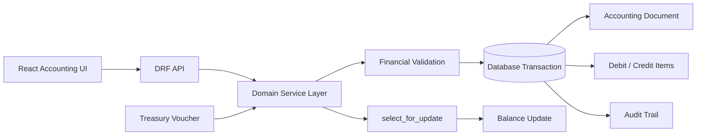

# ERP Accounting — Real-World Code Showcase

> Sanitized, production-derived excerpts from a private accounting / ERP application.

This showcase is based on the actual project source. The samples are intentionally narrowed and lightly refactored so that reviewers can inspect the engineering patterns without exposing private business code, environment configuration, customer data, or deployment details.

## Verified project stack

### Frontend
- React 18.3.1
- Vite 7
- React Router
- Axios
- React Hook Form
- Ant Design
- Chart.js / Recharts
- Jalali date libraries
- Persian RTL interface

### Backend
- Python
- Django
- Django REST Framework
- PostgreSQL-oriented relational domain design

## What the real project implements

### Accounting engine
- Fiscal years
- Sequential document numbering
- Balanced debit / credit validation
- Non-postable account validation
- Accounting period locks
- Document lifecycle: Draft → Pending → Approved / Rejected
- Locked documents
- Document reversal instead of destructive mutation
- Audit logs
- Cost centers, branches, departments and detail accounts

### Treasury
- Banks, cashboxes and imprest accounts
- Receipt / payment vouchers
- Approval permissions
- Automatic accounting document generation
- Balance updates under database locks
- Reversal vouchers
- Closed-period protection
- Ownership-aware workflow actions

## Included public excerpts

```text
backend/
  document_numbering.py
  document_lifecycle.py
  treasury_service.py
  treasury_permissions.py

tests/
  test_financial_invariants.py

frontend/
  AccountingDocumentFormExcerpt.jsx
```

## Architecture



## Key engineering decisions

- Financial mutations run inside `transaction.atomic`.
- Sequence generation uses row locking to reduce concurrent numbering collisions.
- Approved documents are not silently edited; reversal records preserve history.
- Debit and credit invariants are checked before persistence.
- Closed fiscal years and accounting periods block writes.
- Treasury balance changes are coordinated with generated accounting documents.
- Object-level permissions distinguish voucher owners from financial reviewers.
- Frontend validation mirrors important UX constraints while the backend remains authoritative.

## Sanitization

The private repository contains local configuration and test credentials. None of those values are copied here. Public samples also omit organization-specific naming, internal URLs, private identifiers and full proprietary modules.

[← Back to profile](../../README.md)
