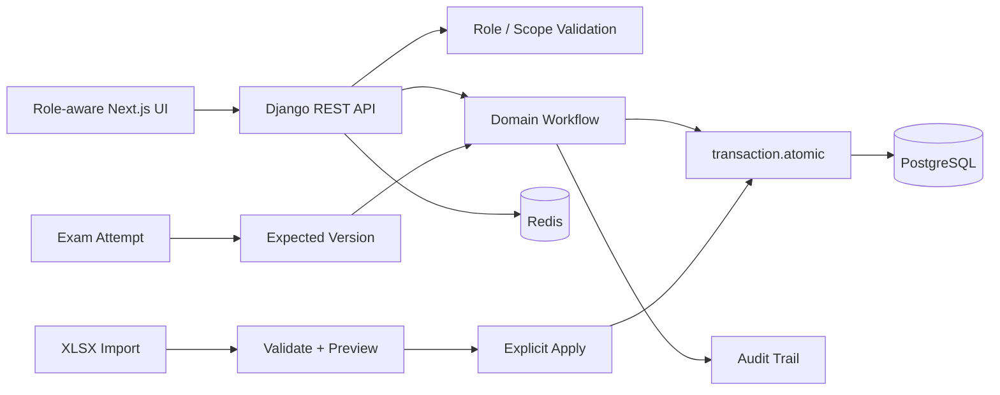

# LMS — Real-World Code Showcase

> Sanitized, source-verified engineering excerpts from a private customer LMS.

This showcase is based on the actual project source. Customer identity, demo accounts, internal configuration, environment values, private content, and organization-specific details are intentionally excluded.

## Verified stack

### Frontend
- Next.js 16.3.6
- React 19
- TypeScript 5.7
- Playwright
- Vazirmatn
- lucide-react

### Backend
- Django 5.2
- Django REST Framework 3.16
- PostgreSQL
- Redis
- Gunicorn
- ReportLab
- OpenPyXL

### Production
- Docker Compose
- PostgreSQL 17
- Redis 7
- Caddy
- Health / readiness checks
- Background maintenance worker
- Optional SMS worker
- Persistent private media

## Why these samples were selected

The private LMS contains many modules. The public showcase focuses on three patterns that best demonstrate production engineering depth:

1. **Safe bulk data import** — preview before apply, keyed file fingerprinting, expiry, row validation, transactional apply, and audit logging.
2. **Online exam lifecycle** — attempt state, optimistic version checks, automatic scoring, descriptive grading, controlled result publication, retakes, and audit history.
3. **Grade correction workflow** — proposal → management decision → controlled publication, with version-aware conflict protection.

## Included samples

```text
backend/
  safe_import_workflow.py
  exam_lifecycle.py

tests/
  test_workflow_invariants.py

frontend/
  GradeCorrectionExcerpt.tsx
```

## Architecture



## Production-oriented decisions verified in source

- Server-side role enforcement rather than UI-only permissions.
- Preview and apply are separate phases for bulk imports.
- Uploaded import files are fingerprinted with an HMAC-based digest before apply.
- Apply operations use database transactions and locking.
- Exam attempts use version fields to reject stale writes.
- Result publication is blocked while grading is incomplete.
- Retakes are controlled rather than silently resetting attempts.
- Grade changes preserve review history instead of overwriting published values directly.
- Private files are not exposed as normal public static assets.
- Production topology includes health checks, Redis, PostgreSQL, Caddy and background workers.
- Backend and browser-level automated tests cover real domain workflows.

## Sanitization policy

The uploaded customer project contains organization names, local demo credentials and environment placeholders. None of those values are included in this public showcase. The excerpts are simplified and renamed where needed while preserving the engineering pattern being demonstrated.

[← Back to profile](../../README.md)
